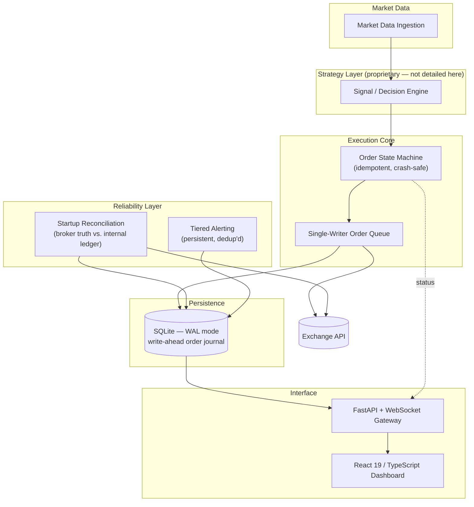

# AEGIS — Adaptive Execution & Global Intelligence System

**Automated trading system for crypto derivatives, built test-first and run unattended, from research through to live order execution.**

> **This is a portfolio overview repository.** AEGIS is a private, production trading system. Its source code, strategy logic, and configuration are not published here or anywhere public. This repository exists to document the engineering — architecture, reliability design, and the problems solved — not the trading methodology.

---

## Project Overview

AEGIS is a single-operator, single-process trading system that takes a strategy from historical research through backtesting to live order execution against a crypto derivatives exchange, running unattended on a home machine. It was built test-first, with correctness treated as a hard requirement rather than an aspiration — the system manages real capital, and a silent bug has direct financial consequences.

The public engineering story here is deliberately about the *how*, not the *what*: how do you build software that is allowed to place real orders with no human watching, and trust it not to duplicate an order, lose one, or leave a position unprotected — ever?

## Motivation

Most portfolio trading projects stop at the backtest. AEGIS was built to answer a harder question: what does it take for an automated system to be safely left running unattended, for weeks, against a live exchange, with real money at risk? That constraint — not the trading idea itself — is what drove almost every architectural decision in this repository: the single-writer order queue, the finite-state machine, the reconciliation layer, the alerting design.

## High-Level Architecture

**Deliberately excluded from this diagram:** signal generation, position sizing, risk parameters, and every proprietary decision rule. What's shown is the shape of the plumbing, not the logic flowing through it.

## Engineering Challenges

- **Zero-tolerance order safety on an unattended machine.** No duplicate orders after a crash, no order silently dropped, no position ever left without its protective stop — solved with a finite-state machine, deterministic idempotency keys, and write-ahead journaling rather than retries-and-hope.
- **Recovering from arbitrary downtime without confusion.** On restart after five minutes or five days, the system has to reconstruct truth from the exchange itself, correctly tell "the owner manually intervened" apart from "the system's own state has drifted," and never replay a stale trading decision against a market that has since moved on.
- **True real-time state with zero client polling.** A FastAPI + native WebSocket layer pushes state deltas to the browser the instant they happen, serving both the API and the compiled frontend from one process.
- **Deploying the same system unmodified on Windows and macOS**, with no Node.js required on the trading machine and no database server to administer — a single portable SQLite file and a pre-built static frontend.
- **Making failure loud instead of silent.** A severity-tiered alerting system that persists across restarts, requires explicit human acknowledgment, and de-duplicates so a real problem is never lost in noise — and never silently auto-clears.

## By the numbers

| Metric | Value |
|---|---|
| Codebase | 115 Python files, about 12,650 lines |
| Automated tests | 251 test functions across 37 modules, written test-first module by module |
| Test structure | One test module per source module, no parametrised expansion and no test classes, so the count is a count of distinct cases |
| Build cadence | 87 commits |
| Order model | A ten-state finite state machine with an explicit transition table; illegal transitions raise |
| Durability | SQLite in write-ahead-logging mode, and a dual-entry, append-only, hash-chained audit ledger |
| Protection layers | Four independent ones, described below |
| Mode | Paper trading. No live capital, and no performance figures published |

*Statistics describe engineering scope only. No performance figures are published here or
anywhere else, including from paper trading.*

## Four independent protection layers

The design assumption is that any single safety mechanism will eventually fail, including the
one that is supposed to catch the others failing. So protection is layered, and each layer
survives the failure of the one above it.

1. **Pre-arm checks.** Every check is binary and arming live is refused unless all of them pass.
   There is no partially armed state and no override flag.
2. **A process-level kill switch.** One command cancels all open orders and flattens all
   positions at the venue. It is tested by a fire drill that places one real order in a demo
   account and then kills it, capturing the evidence, because a kill switch that has never been
   fired is a hypothesis rather than a control.
3. **A venue-side dead-man switch.** The exchange itself cancels resting orders if the system
   stops sending its heartbeat. This one keeps working when the process is gone, which is
   exactly when the first two cannot help.
4. **An external dead-man monitor.** A monitor off this machine expects a ping on a schedule.
   If the pings stop, the machine, its network or its power has failed, and something outside
   the blast radius knows about it.

A related piece worth calling out is the manual-intervention classifier. It is a pure function
that distinguishes a human deciding to force-exit a position from the system malfunctioning.
Without it, an owner closing a trade by hand looks identical to a fault, and the system either
fights the human or ignores a real failure. Both are worse than asking the question explicitly.

## Documentation

| Document | What is in it |
|---|---|
| [docs/ORDER-FSM.md](docs/ORDER-FSM.md) | The ten states, the transition table, why FAILED and REJECTED must never be merged, how the idempotency key is derived from intent, and the decision function in full |
| [docs/RECONCILIATION.md](docs/RECONCILIATION.md) | Recovery after arbitrary downtime: recomputing desired state rather than replaying stale intents, the fixed safety ordering, and the seven-way discrepancy taxonomy |
| [DISCLOSURE.md](DISCLOSURE.md) | What is published here, what never will be, and the line between them |

## Test suite

251 test functions across 37 modules. The suite has one test module per source module, which is
a consequence of how it was built: the tests for a module were written before the module.

There are no parametrised cases and no test classes anywhere in the suite, so 251 is a count of
distinct test functions rather than an inflated figure. Anyone can verify that by grepping the
suite.

The modules that carry the most weight:

| Module | Covers |
|---|---|
| `tests/test_order_fsm.py` | The state machine: legal transitions, illegal ones raising, and every branch of the decision function, all without a broker because the module is pure |
| `tests/test_reconcile.py` | Recovery. Held against wanted, across every discrepancy kind, including unprotected positions and orphan orders |
| `tests/test_state_store.py` | The durable spine: crash safety and recovery of persisted state |
| `tests/test_ledger.py` | The append-only, hash-chained accounting ledger |
| `tests/test_live_risk.py` | The kill switch and the risk guards, as pure decision functions |
| `tests/test_kill.py` | Cancelling every open order and flattening every position |
| `tests/test_deadman.py` | The venue-side dead-man switch |
| `tests/test_external_heartbeat.py` | The off-machine monitor |
| `tests/test_preflight.py` | That arming live is refused unless every binary check passes |
| `tests/test_intervention.py` | Telling a deliberate manual exit apart from a system fault |
| `tests/test_execution.py` | The router driving the state machine against a broker gateway |
| `tests/test_broker_signing.py` | Request signing against the venue API |
| `tests/test_recovery_supervisor.py` | Restart behaviour under supervision |

The remaining modules cover market data, the regime layer, sleeves, sizing, the portfolio
construction path and the user interface server. Those closest to strategy are not detailed
here.

## Technology Stack

**Backend** — Python 3.11+ (asyncio), FastAPI, native WebSocket, APScheduler, SQLite (WAL mode)
**Frontend** — React 19, TypeScript, TanStack Router, Tailwind CSS, Radix UI, Recharts
**Data / Research tooling** — pandas, numpy, pyarrow
**Testing** — pytest, pytest-asyncio — 251 test functions across 37 modules, written test-first module by module
**Deployment** — single supervised process, no containers, no message broker, cross-platform (Windows/macOS) native launchers

## Screenshots

*(To be added — see the screenshot capture guide before publishing any images: paper-mode only, no real account figures, no code views of the strategy modules.)*

- Dashboard overview (layout and design)
- Real-time system status / connectivity panel
- Test suite run summary
- Architecture diagram (this page)

## Future Work

- Additional broker/exchange integrations behind the same execution core
- Expanded automated observability (metrics, structured tracing) around the existing alerting layer
- Further deployment automation for multi-machine redundancy

---

*Source code, configuration, and trading methodology are intentionally not included in this repository. For engineering discussion, feel free to reach out.*
