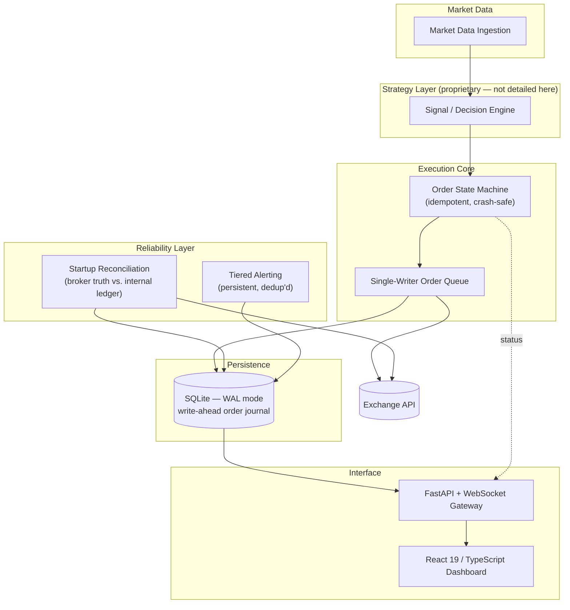

# AEGIS — Adaptive Execution & Global Intelligence System

**Institutional-grade automated trading system for crypto derivatives — architected, built, and tested solo, end-to-end from research to live order execution.**

> **This is a portfolio overview repository.** AEGIS is a private, production trading system. Its source code, strategy logic, and configuration are not published here or anywhere public. This repository exists to document the engineering — architecture, reliability design, and the problems solved — not the trading methodology.

---

## Project Overview

AEGIS is a single-operator, single-process trading system that takes a strategy from historical research through backtesting to live order execution against a crypto derivatives exchange, running unattended on a home machine. It was built by one engineer, test-first, with correctness treated as a hard requirement rather than an aspiration — the system manages real capital, and a silent bug has direct financial consequences.

The public engineering story here is deliberately about the *how*, not the *what*: how do you build software that is allowed to place real orders with no human watching, and trust it not to duplicate an order, lose one, or leave a position unprotected — ever?

## Motivation

Most portfolio trading projects stop at the backtest. AEGIS was built to answer a harder question: what does it take for an automated system to be safely left running unattended, for weeks, against a live exchange, with real money at risk? That constraint — not the trading idea itself — is what drove almost every architectural decision in this repository: the single-writer order queue, the finite-state machine, the reconciliation layer, the alerting design.

## High-Level Architecture

**Deliberately excluded from this diagram:** signal generation, position sizing, risk parameters, and every proprietary decision rule. What's shown is the shape of the plumbing, not the logic flowing through it.

## Engineering Challenges

- **Zero-tolerance order safety on an unattended machine.** No duplicate orders after a crash, no order silently dropped, no position ever left without its protective stop — solved with a finite-state machine, deterministic idempotency keys, and write-ahead journaling rather than retries-and-hope.
- **Recovering from arbitrary downtime without confusion.** On restart after five minutes or five days, the system has to reconstruct truth from the exchange itself, correctly tell "the owner manually intervened" apart from "the system's own state has drifted," and never replay a stale trading decision against a market that has since moved on.
- **True real-time state with zero client polling.** A FastAPI + native WebSocket layer pushes state deltas to the browser the instant they happen, serving both the API and the compiled frontend from one process.
- **Deploying the same system unmodified on Windows and macOS**, with no Node.js required on the trading machine and no database server to administer — a single portable SQLite file and a pre-built static frontend.
- **Making failure loud instead of silent.** A severity-tiered alerting system that persists across restarts, requires explicit human acknowledgment, and de-duplicates so a real problem is never lost in noise — and never silently auto-clears.

## Technology Stack

**Backend** — Python 3.11+ (asyncio), FastAPI, native WebSocket, APScheduler, SQLite (WAL mode)
**Frontend** — React 19, TypeScript, TanStack Router, Tailwind CSS, Radix UI, Recharts
**Data / Research tooling** — pandas, numpy, pyarrow
**Testing** — pytest, pytest-asyncio — 295 tests, written test-first (TDD) module-by-module
**Deployment** — single supervised process, no containers, no message broker, cross-platform (Windows/macOS) native launchers

## Screenshots

*(To be added — see the screenshot capture guide before publishing any images: paper-mode only, no real account figures, no code views of the strategy modules.)*

- Dashboard overview (layout and design)
- Real-time system status / connectivity panel
- Test suite run summary
- Architecture diagram (this page)

## Future Work

- Additional broker/exchange integrations behind the same execution core
- Expanded automated observability (metrics, structured tracing) around the existing alerting layer
- Further deployment automation for multi-machine redundancy

---

*Source code, configuration, and trading methodology are intentionally not included in this repository. For engineering discussion, feel free to reach out.*
