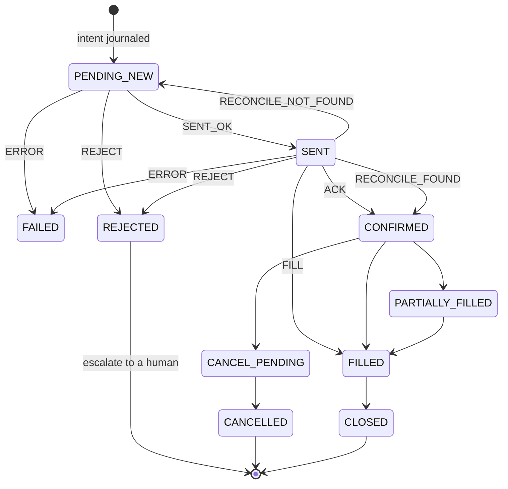

# The order finite state machine

Every order in AEGIS moves through one explicit state machine. It is a pure module: it performs
no input or output, it only decides. The router does the talking to the broker and feeds events
back in. That separation is what makes the whole thing testable without a network.

The module docstring states the guarantees it exists to hold, quoted from
`aegis/order_fsm.py`:

> 1. Idempotent placement. `client_oid` is a deterministic hash of the intent, so a crash between
>    "sent" and "recorded" can never double-place: on recovery we query the broker by
>    `client_oid` and adopt whatever exists.
> 2. No naked positions. An entry is not DONE until its protective stop is confirmed. `decide()`
>    forces ATTACH_STOP first, always.
> 3. No blind retries. An unacked or errored order is never resent. We query the broker to learn
>    the truth, then place fresh only if it truly never landed.
> 4. No auto-retry on broker rejection. A rejection escalates, because it means a margin or
>    validation problem that retrying will not fix.
> 5. Loud on bugs. Illegal state transitions raise, they do not silently pass.
>
> Persist the order to the journal BEFORE the network call, so the truth is always recoverable
> after any crash.

## States

```python
class OrderState(str, Enum):
    PENDING_NEW = "PENDING_NEW"     # intent journaled, not yet sent
    SENT = "SENT"                   # API call made, awaiting ack
    CONFIRMED = "CONFIRMED"         # broker acked with order_id
    PARTIALLY_FILLED = "PARTIALLY_FILLED"
    FILLED = "FILLED"
    FAILED = "FAILED"              # network/transport error before ack (unknown outcome)
    REJECTED = "REJECTED"          # broker explicitly rejected (known outcome)
    CANCEL_PENDING = "CANCEL_PENDING"
    CANCELLED = "CANCELLED"
    CLOSED = "CLOSED"
```

The distinction between `FAILED` and `REJECTED` is the one that matters most. They look similar
in a log and they are opposites. `REJECTED` is a known answer: the broker received the order and
said no, so retrying is pointless and a human should hear about it. `FAILED` is an unknown
answer: the transport broke before any acknowledgement, and the order may be live, may be
dead, and the only safe move is to go and ask.

Systems that collapse these two into one error state are the systems that double-place.



`RECONCILE_NOT_FOUND` returning to `PENDING_NEW` is the recovery path. If the broker has never
heard of the order, it is safe to treat the intent as unsent and place it again, because the id
is derived from the intent and a duplicate would be recognised.

## The idempotency key

```python
def make_client_oid(bar_iso: str, sleeve: str, symbol: str, side: str, seq: int = 0) -> str:
    """Deterministic, broker-safe (<=36 ascii). Same intent -> same id -> idempotent."""
    raw = f"{bar_iso}|{sleeve}|{symbol}|{side}|{seq}"
    h = hashlib.sha256(raw.encode()).hexdigest()[:24]
    return f"aeg-{h}"               # 4 + 24 = 28 chars
```

The key is derived, not generated. A random id would defeat the entire mechanism, because a
retry after a crash would arrive with a new id and the broker would have no way to know it had
seen the order before. Deriving it from the intent means the same decision always produces the
same id, so the broker itself becomes the deduplicator.

The length constraint is not decoration. Broker client order id fields have limits, and an id
that gets truncated server side stops being unique.

## The decision function

```python
def decide(order: ManagedOrder, seconds_since_send: float, timeout: float) -> RouterAction:
    """Given current state + how long we've waited, what should the router do next?

    Safety precedence: a filled-but-unprotected entry ALWAYS attaches its stop before
    anything else. Never assume an unacked order's fate — query the broker."""
    st = order.state

    # naked-risk guard wins over everything
    if order.needs_protection and st in (OrderState.FILLED, OrderState.PARTIALLY_FILLED):
        return RouterAction.ATTACH_STOP

    if st == OrderState.PENDING_NEW:
        return RouterAction.PLACE
    if st == OrderState.SENT:
        return RouterAction.QUERY_BROKER if seconds_since_send >= timeout else RouterAction.WAIT
    if st == OrderState.FAILED:
        return RouterAction.QUERY_BROKER          # unknown outcome -> ask, don't resend
    if st == OrderState.REJECTED:
        return RouterAction.ESCALATE              # known NO -> human/alert, no auto-retry
    if st in (OrderState.CONFIRMED, OrderState.FILLED, OrderState.CANCELLED, OrderState.CLOSED):
        return RouterAction.DONE
    return RouterAction.WAIT
```

The naked-risk guard is checked before the state is even examined. A position that is filled and
has no protective stop attached is the worst state the system can be in, so nothing else is
allowed to happen while it is true.

Because `decide` is a pure function of state and elapsed time, every branch is directly
testable, which is why `tests/test_order_fsm.py` exists and why none of it needs a broker.
